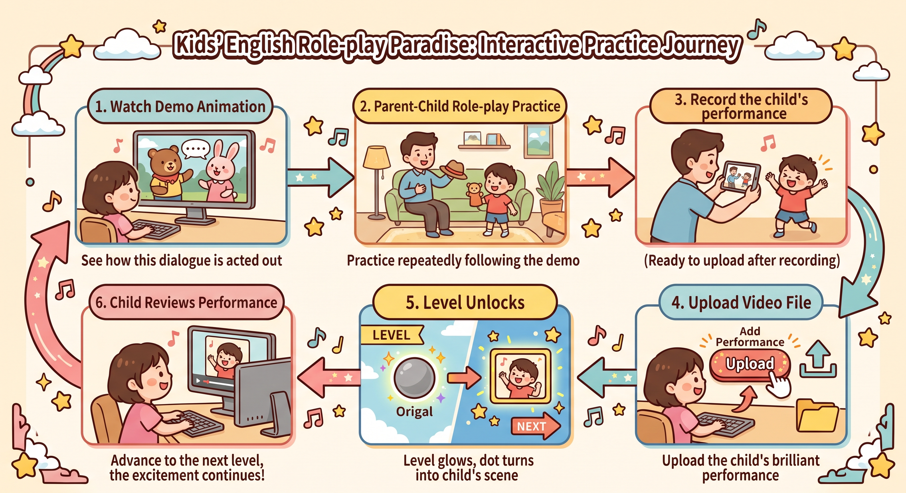
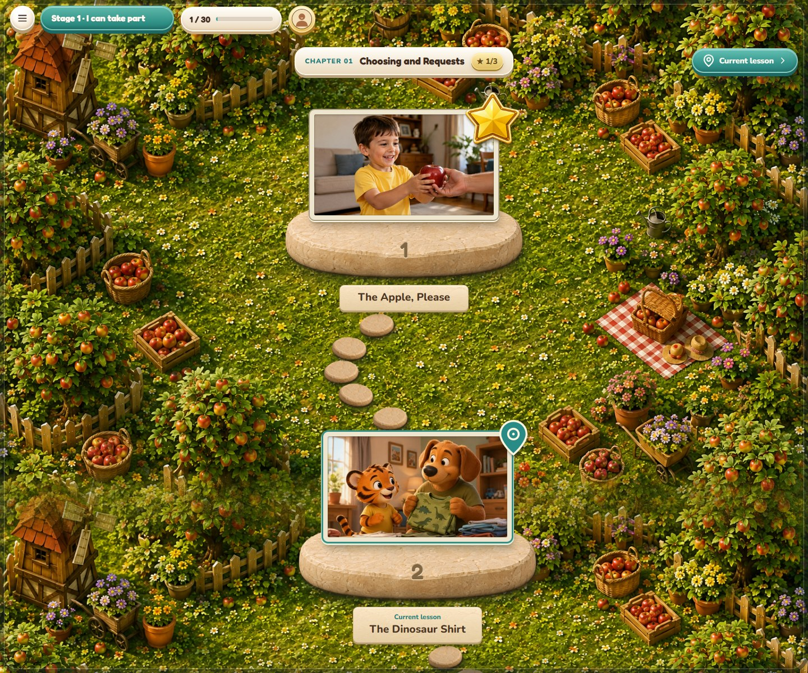
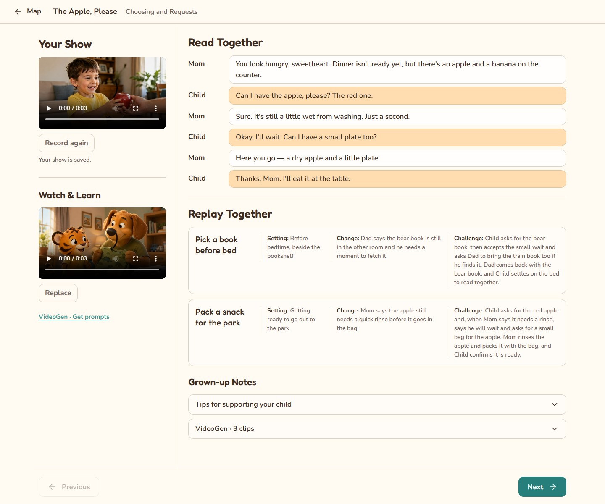

# TigerTales

[EN](README.md) | **ZH**

TigerTales 把亲子英语角色扮演整理成一张闯关地图：看示范、线下练习、录下表演，再从地图上回看。练习由家长和孩子一起完成，应用负责提供对话、保存录像和展示进度。

## 玩法

1. **看示范**：了解情境和对话；没有视频时也可以直接共读台词。
2. **一起练习**：分配角色，用身边的道具把对话演出来。
3. **录下表演**：使用页面内的摄像头，或用其他设备拍摄。
4. **保存或上传**：先回看，满意后保存；也可以重录。
5. **点亮关卡**：当前课显示完成金星和表演画面，下一课解锁。
6. **回看再玩**：从地图打开自己的表演，换个情境再练，或进入下一课。

## 产品特性

### 地图与进度

10 个主题章节、30 节生活对话，沿踏石小路排列。背景和关卡一起滚动，课程目录可以直接选课，当前课标记便于继续上次的练习。

已完成的关卡显示表演画面和一颗金星，未完成的关卡显示示范缩略图或占位画框。金星只表示已保存表演，不是评分；尚未解锁的课也可以预览。

*界面截图使用演示素材。*

### 一课内完成观看、共读和复练

| 功能 | 内容 |
| --- | --- |
| 表演回放 · Your Show | 录制、回看或重录自己的表演。 |
| 示范视频 · Watch & Learn | 播放、添加或替换示范。 |
| 对话共读 · Read Together | 按角色展示完整对话。 |
| 情境复练 · Replay Together | 每课提供两个变化情境，换道具或场景再练。 |
| 家长提示 · Grown-up Notes | 查看练习目的和引导建议，默认折叠。 |

### 录制与个人进度

页面内录制后可立即回放，选择重来或保存，也支持上传已有视频。保存表演后，地图同步更新。每个账号分别保存录像和进度，可设置昵称与头像。

### 示范视频制作

VideoGen 为每课提供三段可复制的制作提示词。将提示词交给外部视频工具，生成并合并三段视频，再上传为课程示范。三段是制作拆分，课程仍展示完整对话。

当前包含 30 课、90 份提示词草稿。应用本身不生成视频，仓库不附带制作完成的示范视频。

### 桌面与 Web

Windows Electron 版与 Web 版共用界面。桌面并排展示视频和对话，手机使用视频页签和单列阅读。本地运行时，录像保存在自己的电脑上；也支持部署到自己的服务器。

[开发文档](DEVELOPMENT.md) · [课程说明](curriculum/README.md) · [MIT 许可证](LICENSE)
